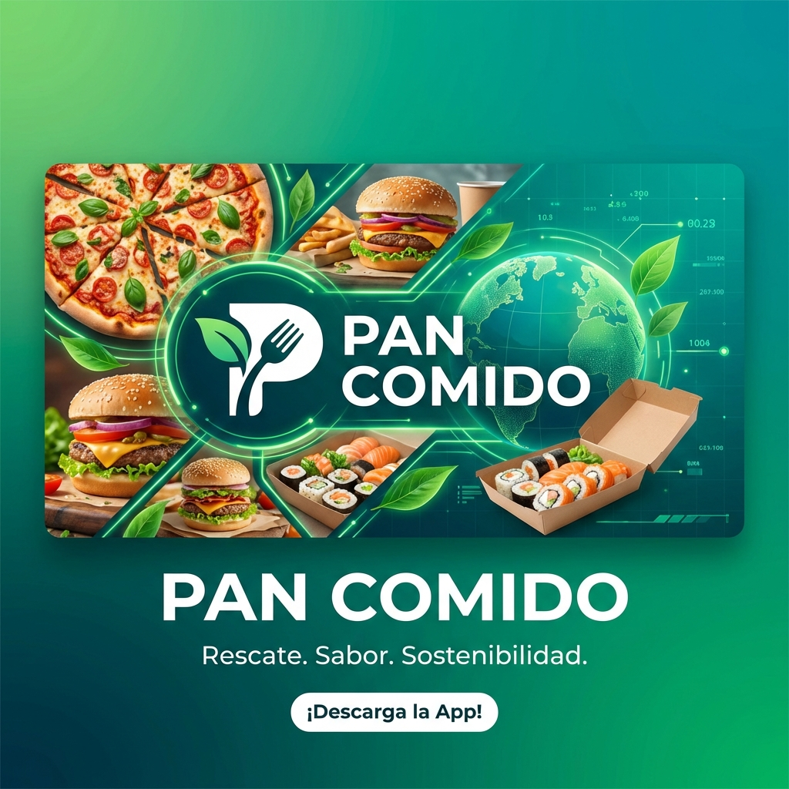

# Pan Comido 🍕

**Rescatando comida, salvando el planeta.**

**Pan Comido** es una plataforma innovadora que conecta restaurantes con excedentes de comida deliciosa y usuarios que buscan opciones económicas. ¡Ayudamos a reducir el desperdicio de alimentos mientras ofrecemos descuentos de hasta el 70%!

---

## 🚀 Características Principales

La aplicación está diseñada con tres experiencias de usuario distintas:

### 📱 1. App de Usuario (PWA / Android)

Explora, reserva y disfruta.

- **Descubre ofertas**: Mapa y lista de restaurantes cercanos con "Cajas Sorpresa".
- **Ahorra dinero**: Comida de alta calidad a una fracción de su precio original.
- **Perfil completo**: Historial de pedidos y métricas de cuánto has ahorrado y cuánto CO2 has evitado.
- **Interactivo**: Sistema de "Favoritos" y notificaciones (Demo).

### 🏪 2. Panel de Restaurante (Socio)

Gestión sencilla para tus excedentes.

- **Dashboard**: Vista rápida de ganancias y pedidos del día.
- **Gestión de Ofertas**: Crea y activa "Cajas Sorpresa" en segundos.
- **Control de Pedidos**: Valida códigos de recogida de los clientes.

### 🛡️ 3. Panel de Administración

Control total de la plataforma.

- **Visión Global**: Métricas en tiempo real de ingresos, usuarios y restaurantes activos.
- **Gestión Integral**: Supervisión de restaurantes, pedidos y configuración de la app.
- **Reportes**: Análisis de tendencias y desempeño.

---

## 🛠️ Tecnologías

Este proyecto está construido con un enfoque moderno y ligero:

- **Frontend**: HTML5, CSS3, Vanilla JavaScript (Sin frameworks pesados).
- **Móvil**: PWA (Progressive Web App) compatible con iOS y Android.
- **Empaquetado**: [Capacitor](https://capacitorjs.com/) para generar el APK nativo de Android.
- **Backend (Opcional)**: Integración lista para [Supabase](https://supabase.com/) (actualmente funciona con modo Demo local).
- **Mapas**: Leaflet.js para la ubicación de restaurantes.

---

## 📦 Instalación y Uso

### Prerrequisitos

- [Node.js](https://nodejs.org/) instalado.
- [Git](https://git-scm.com/) instalado.

### Pasos

1. **Clonar el repositorio:**

    ```bash
    git clone https://github.com/MSSATANASS/Pan-Comido.git
    cd Pan-Comido
    ```

2. **Instalar dependencias:**

    ```bash
    npm install
    ```

3. **Ejecutar en desarrollo (Navegador):**
    Simplemente abre el archivo `index.html` en tu navegador o usa una extensión como "Live Server".

4. **Generar APK de Android:**

    ```bash
    # Construir los assets
    npm run build

    # Sincronizar con Android
    npx cap sync

    # Abrir en Android Studio
    npx cap open android
    ```

---

## 🔗 Demo en Vivo

¡Prueba la aplicación directamente en tu navegador o móvil!

👉 **[Ver Demo en GitHub Pages](https://mssatanass.github.io/Pan-Comido/)**

(Nota: Para la mejor experiencia en móvil, usa la opción "Agregar a Inicio" para instalarla como App).

---

## 📄 Licencia

Este proyecto es de código abierto. ¡Siéntete libre de contribuir!
Hecho con 💚 en México.
